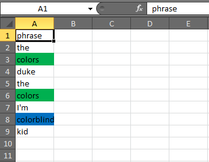

  
Sometimes your collaborators send you important information by highlighting cells in an excel worksheet.




```{r, message=FALSE}
library(dplyr)
library(readxl)

read_excel("popsicle_zone.xlsx")
```

You can use [`tidyxl`](https://nacnudus.github.io/tidyxl/) to extract those formats.

```{r}
library(tidyxl)

cells <- xlsx_cells("popsicle_zone.xlsx")
formats <- xlsx_formats("popsicle_zone.xlsx")
```

`xlsx_cells()` creates a data frame where each cell of the spreadsheet is a row.

```{r}
glimpse(cells)
```

`xlsx_formats()` creates a list of format definitions, which can be used to look up the formatting for cells of interest.

```{r}
glimpse(formats)
```

"Local" styles are applied to individual cells:

```{r, message=FALSE}
fill_color <- formats$local$fill$patternFill$fgColor$rgb

out <- cells %>%
  transmute(
    address,
    character,
    color = fill_color[local_format_id],
    # what alpha channel
    color = stringr::str_replace(color, "^FF", "#")
    )

out
```

Bonus:

```{r, message=FALSE}
library(knitr)
library(kableExtra)

out %>%
  slice(-1) %>% 
  transmute(
    phrase = cell_spec(character, "html", background = if_else(!is.na(color), color, "#FFFFFF"))
    ) %>% 
  kable(escape = FALSE) %>% 
  kable_styling(
    bootstrap_options = c("striped", "hover", "condensed"),
    full_width = FALSE
    ) 
```


